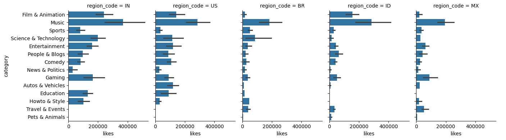
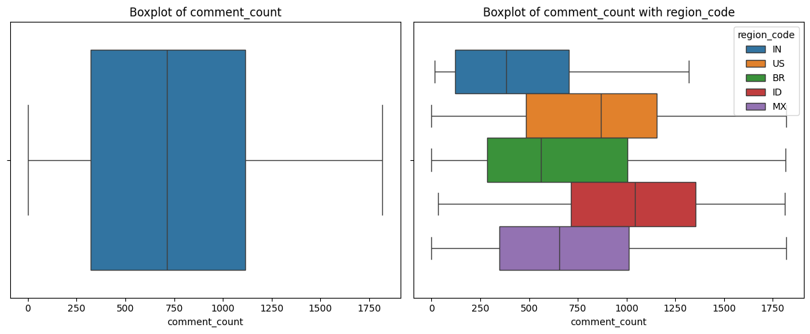
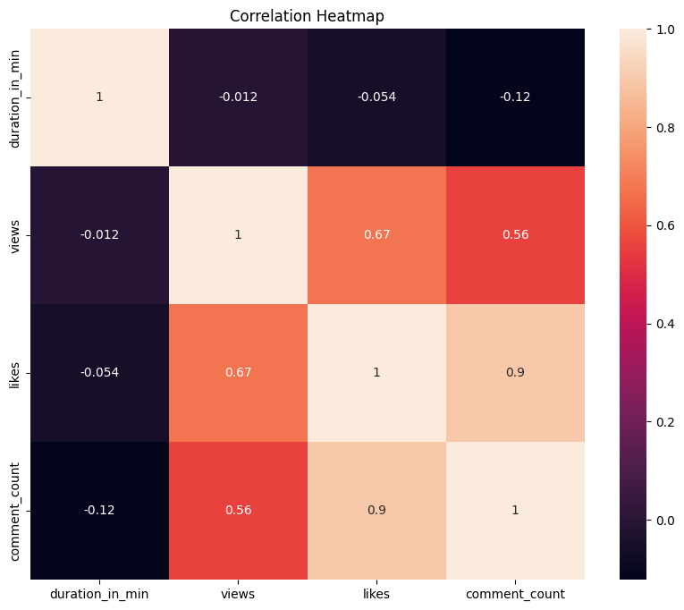
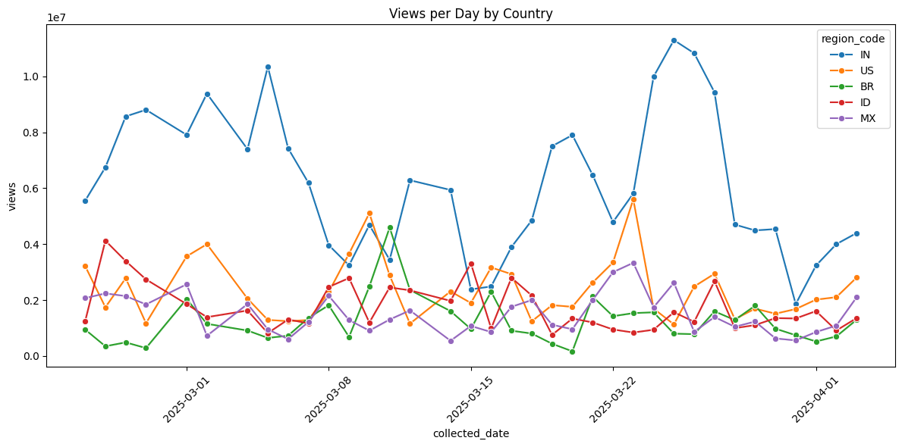
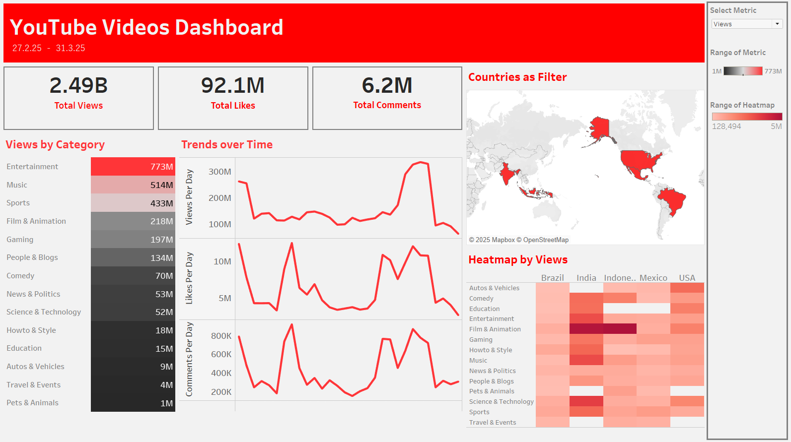
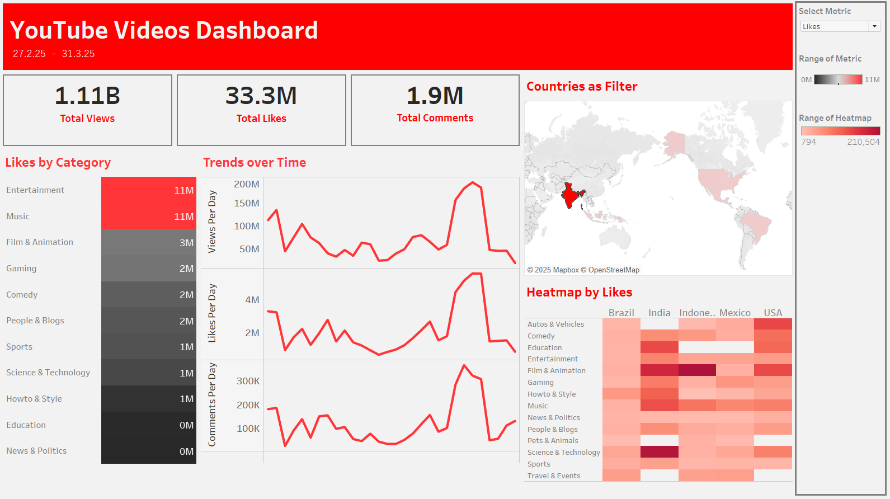

# YouTube Trending Videos Analysis


## Table of Contents
- [Project Overview](#project-overview)
- [Data Description](#data-description)
- [Tools and Technologies Used](#tools-and-technologies-used)
- [Exploratory Data Analysis (EDA)](#exploratory-data-analysis-eda)
- [Key Insights](#key-insights)
- [How to Run the Project](#how-to-run-the-project)
- [Conclusion](#conclusion)
- [For Future Improvements](#for-future-improvements)
- [Resources](#resources)

## Project Overview
This project analyzes the most popular YouTube videos from five different countries over one month (approximately). The aim was to create a dataset from scratch and uncover patterns in video popularity based on views, likes, comments, duration, and category

## Data Description
- **Dataset**: Contains data of 10 most popular videos in 5 countries scraped daily at 12am IST
- **Features**
    - `id` : video id 
    - `region_code` : country codes - [IN: India, US: USA, BR: Brazil, ID: Indonesia, MX: Mexico]	
    - `publish_date`: date the video was published	
    - `channel_id` : channel id for the channel that uploaded said video
    - `channel_name` : corresponding channel name
    - `title` : video title
    - `category_id` : video category id	
    - `duration` : duration of video	
    - `caption` : does video have captions	
    - `views` : views at time of collection	
    - `likes` : likes at time of collection	
    - `comment_count` : comments at time of collection

## Tools and Technologies Used
- Python (Pandas, Matplotlib, Seaborn)
- Tableau (for dashboard visualization)
- Jupyter Notebook
- Visual Studio Code

## Exploratory Data Analysis (EDA)
- Cleaned and processed the dataset
- Looked at distribution of data (univariate analysis)
- Uncovered relationships between different metrics (bivariate analysis)
- Discovered which categories perform best based on numerical metrics and countries
- Tracked interactions over time
- Investigated videos that become popular often
- Looked at top videos and their trends

## Key Insights
- Most of the videos have less views, likes and comments- but there are outliers with extremely high metrics
- If a video has more likes it also has more comments
    - views, however are much harder to predict
- The **Music** and **Entertainment** categories consistently dominated the trending lists.
- **India** had the highest view counts but not nearly as many likes and comments.
    - Indian audience is large but doesn't interact as much.
- **Music** videos tend to get popular in multiple countries and for multiple days (especially Kpop)
- Shorter videos tended to generate **more likes and comments**, although view counts did not show a strong relationship with duration.

## Visualizations





## Dashboard



## How to Run the Project
1. Clone the repository.
2. Open the Jupyter Notebook (`eda_youtube.ipynb`) to view the analysis.
3. Tableau dashboards are available separately.
4. Make sure you have installed required packages:
    ```
    pip install -r requirements.txt
    ```

## Conclusion
This project provided valuable insights into how YouTube content trends differ across countries and categories. Understanding these patterns can help creators and marketers tailor their content strategies for better audience engagement.

## For Future Improvements
- The data collection process was a bit tedious. 
    - it can be definitely optimized to collect data of more countries and longer time or even for multiple times a day (morning vs evening)
    - the titles and descriptions that were not in english were corrupted becuase checking for UTF compatiblity was absent.
- Perform sentiment analysis on video titles and descriptions.
- Predict trending potential using machine learning models.

## Resources
- [YouTube Data API documentation](https://developers.google.com/youtube/v3/docs)
- [**Data with Baraa**](https://github.com/DataWithBaraa) on YouTube
- [**Krish Naik**](https://github.com/krishnaik06) on YouTube
